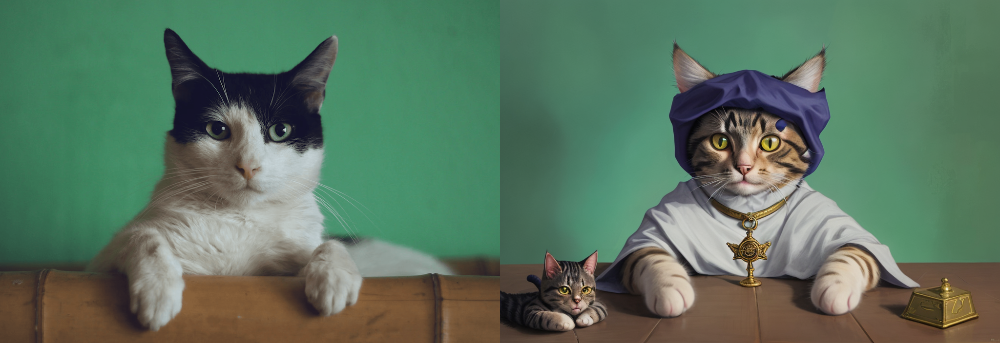

### Perturbed-Attention Guidance

>Perturbed-Attention Guidance (PAG) is a new diffusion sampling guidance that improves sample quality across both unconditional and conditional settings, achieving this without requiring further training or the integration of external modules. PAG is designed to progressively enhance the structure of synthesized samples throughout the denoising process by considering the self-attention mechanisms’ ability to capture structural information. It involves generating intermediate samples with degraded structure by substituting selected self-attention maps in diffusion U-Net with an identity matrix, and guiding the denoising process away from these degraded samples.

This repository contains the **Perturbed Attention Guidance (PAG) Img2Img Pipeline** for Stable Diffusion, now integrated into the `diffusers` library. PR [#9463](https://github.com/huggingface/diffusers/pull/9463) integrated by me.


## Installation

Ensure you have the latest version of the `diffusers` library installed:

```bash
pip install --upgrade diffusers
```

You also need the following dependencies:

```bash
pip install torch torchvision transformers
```

## Usage

Here's a quick example of how to use the Stable Diffusion PAG Img2Img pipeline:

```python
from diffusers import AutoPipelineForImage2Image
from diffusers.utils import load_image, make_image_grid
import torch

# Set device to CUDA for GPU processing
device = "cuda"

# Load the image-to-image pipeline with pre-trained weights
pipe = AutoPipelineForImage2Image.from_pretrained("Lykon/dreamshaper-8", enable_pag=True)
pipe.to(device)

# Load an initial image
init_image = load_image(
    "https://huggingface.co/datasets/huggingface/documentation-images/resolve/main/diffusers/cat.png"
)

# Set a random generator with a specific seed
generator = torch.Generator("cuda").manual_seed(31)

# Define the prompt
prompt = "cat wizard"

# Generate the output image using the pipeline
image = pipe(prompt, image=init_image, generator=generator, pag_scale=0.4).images[0]

# Create a grid of the initial and generated images
make_image_grid([init_image, image], rows=1, cols=2)
```


## Key Parameters

- `guidance_scale`: Controls the overall adherence to the text prompt.
- `pag_scale`: Adjusts the influence of Perturbed Attention Guidance (PAG).


## License

This project is licensed under the Apache 2.0 License - see the [LICENSE](https://www.apache.org/licenses/LICENSE-2.0) file for details.
